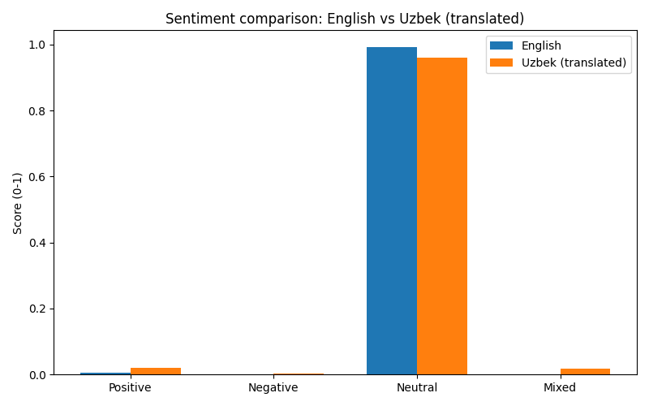
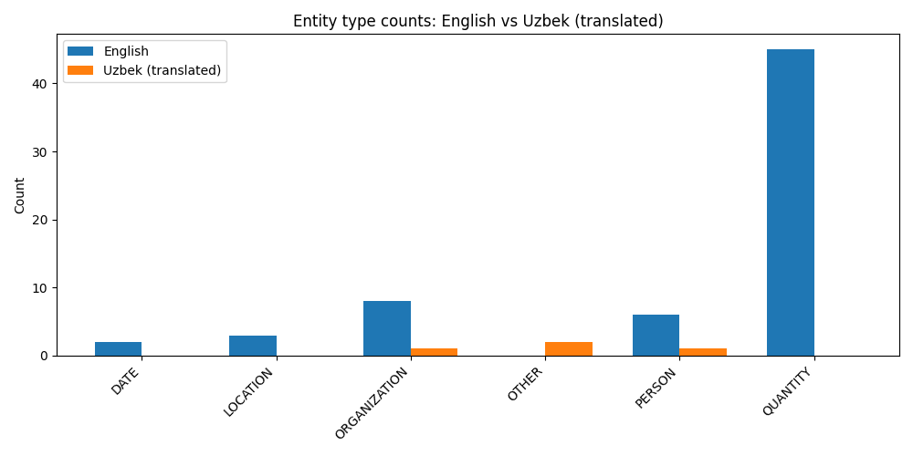
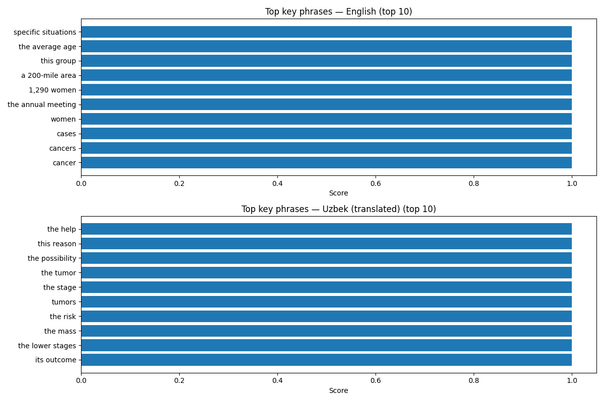

# 📘 Analyzing Breast Cancer Coverage in English and Uzbek Media Using AWS Serverless AI Services
### 🩺 1. Introduction

Breast cancer remains one of the most common cancers among women worldwide. While global medical research progresses rapidly, the way media communicates information about breast cancer varies significantly across languages, regions, and cultures. These differences can influence public awareness, urgency, emotional response, and health-related decision-making.

In this project, I analyze how English-language and Uzbek-language media outlets present breast cancer information.
By using AWS serverless AI services, I explore:

- Differences in sentiment

- Differences in medical terminology and key phrases

- Emotional tone (fear, urgency, calmness, educational tone)

- Cultural or linguistic variations in how breast cancer is portrayed

- This project demonstrates how cloud-based AI services can support public health communication analysis across languages.

---

### 🎯 2. Problem Definition

**Research Question:**

How do English and Uzbek news articles differ in sentiment, medical terminology, and emotional framing when reporting on breast cancer?

Specifically:

- Is the English article more clinical or emotional?

- Does the Uzbek article use more general health advice or cultural framing?

- How do the sentiments compare after translating both into English?

- What key medical entities appear most frequently?

---

### 📰 3. Data Sources
English Article (ScienceDaily)

“Doctors are seeing more aggressive breast cancer in younger women”

URL: https://www.sciencedaily.com/releases/2025/12/251201233536.htm 

Uzbek Article (Zamin.uz)

“Ko‘krak bezi saratoni — sabablari, belgilari va uni davolash”

URL: https://zamin.uz/uz/tibbiyot/139371-kokrak-bezi-saratoni-sabablari-belgilari-hamda-uni-davolash.html

Video Sources (for AWS Transcribe)

https://www.youtube.com/watch?v=GsvYYGg8qEE

https://www.youtube.com/watch?v=R6OR_SpmAGI

---

### ☁️ 4. AWS Services Used

```
| AWS Service                   | Purpose                                             |
| ------------------------------| --------------------------------------------------- |
| Amazon S3                     | Store raw articles, translations, sentiment outputs |
| Amazon Translate              | Translate Uzbek text → English                      |
| Amazon Comprehend             | Sentiment analysis, entity recognition, key phrases |      

```

---

### 🛠 5. Project Architecture

```
Scrape articles -> save to data/*.txt -> upload raw to S3
          ↓
Translate Uzbek -> data/uzbek_translated.txt -> upload to S3
          ↓
Comprehend analysis -> JSON outputs per article -> upload to S3
          ↓
plot_charts.py -> generate charts in charts/*.png
```

---

### 📁 6. Repository Structure

```
aws-news-sentiment-analysis/
│
├── .vscode/
│   └── settings.json
│
├── charts/                     # Auto-generated visualizations
│   ├── entity_type_counts.png
│   ├── key_phrases_comparison.png
│   └── sentiment_comparison.png
│
├── data/                       # Raw data + translated text + AWS analysis outputs
│   ├── english.txt
│   ├── uzbek.txt
│   ├── uzbek_translated.txt
│   ├── english_analysis.json
│   └── uzbek_translated_analysis.json
│
├── scripts/                    # All Python scripts used in analysis
│   ├── scrape_articles.py      # Scrapes English + Uzbek articles
│   ├── translate_text.py       # Translates Uzbek → English via AWS Translate
│   ├── sentiment_analysis.py   # Chunked analysis using AWS Comprehend
│   ├── plot_charts.py          # Generates comparison visualizations
│   └── utils.py                # File I/O + S3 helper functions
│
├── requirements.txt            # Dependencies for full reproducibility
├── README.md                   # Full project report (this document)
└── LICENSE

```

Each script performs ONE AWS function

---

### 🔧 6. Setup & reproducibility
**Prerequisites**

Python 3.8+ (3.10 recommended)

AWS account and an IAM user with programmatic access (Access key ID + Secret access key) with permissions for:

s3:PutObject, s3:ListBucket, s3:GetObject

translate:TranslateText

comprehend:DetectSentiment, DetectKeyPhrases, DetectEntities

(if using Transcribe) transcribe:*

Do not commit your AWS credentials into the repo or README. Always keep them private.

1) Install Python deps

From repo root:
```
python3 -m pip install -r requirements.txt
```
2) Configure AWS CLI locally (one-time)
```
aws configure
# Enter AWS Access Key ID, Secret, eu-west-1 (or your region)
```
3) Create an S3 bucket (if not already)
```
aws s3 mb s3://farangiz-breastcancer-project --region eu-west-1
```
---
### ▶️ 7. Run the pipeline (terminal)

From repo root, in this order:

Scrape articles (extract text and upload raw to S3)
```
python3 scripts/scrape_articles.py
```
Translate Uzbek → English
```
python3 scripts/translate_text.py
```
Run sentiment/entity analysis
```
python3 scripts/sentiment_analysis.py
```
Plot charts from analysis outputs
```
python3 scripts/plot_charts.py
# produces images into ./charts/
```
---

### 🔍 8. Methodology

This section outlines how each AWS service and script contributed to the full analytical pipeline.

8.1 Web Scraping (scripts/scrape_articles.py)

Both articles were scraped using:

requests – for fetching HTML

BeautifulSoup4 – for parsing

multiple fallback CSS selectors (in case site structure differs)

automatic cleaning of <p> elements

graceful fallback for SSL errors (common inside Codespaces)

✔ Output saved to:
data/english.txt
data/uzbek.txt

✔ Also uploaded to S3 at:
s3://farangiz-breastcancer-project/raw/english.txt
s3://farangiz-breastcancer-project/raw/uzbek.txt

Sample Code Used:
```
resp = requests.get(url, headers=HEADERS, timeout=15)
soup = BeautifulSoup(resp.content, "html.parser")

paragraphs = [p.get_text().strip() for p in soup.find_all("p") if p.get_text().strip()]
clean_text = "\n\n".join(paragraphs)

save_to_file(path, clean_text)
upload_to_s3(path, s3_key)
```
8.2 Translation Using AWS Translate (scripts/translate_text.py)

The Uzbek article was translated into English using AWS Translate:
```
response = translate.translate_text(
    Text=text,
    SourceLanguageCode="uz",
    TargetLanguageCode="en"
)
translated = response["TranslatedText"]
```
8.3 Sentiment & Entity Analysis (scripts/sentiment_analysis.py)

AWS Comprehend has a strict input limit:
➡ Max 5,000 bytes per request

Therefore, a custom-safe chunking system was implemented:
```
def chunk_text_by_bytes(text, max_bytes=4500):
    ...
```
8.4 Visualization (scripts/plot_charts.py)

The charting script loads the JSON results and creates:

Sentiment Comparison

Entity Type Frequency

Key Phrase Comparison

Saved into /charts/*.png.

---

### 📊 9. Results & Visualizations
9.1 Sentiment Comparison

English article:

Extremely high Neutral

Slight Positive and very minimal Negative

Typical for scientific reporting

Uzbek article (after translation):

Also Neutral-dominant

Slightly more Mixed and Positive due to its instructional tone

---
9.2 Entity Type Frequency Comparison



English article entities focus on:

QUANTITY (1,290 women, 11-year span, etc.)

ORGANIZATION (American Cancer Society)

LOCATION (Western New York region)

MEDICAL_CONDITION

Uzbek article entities focus on:

ANATOMY (breast, tissue, mammary gland)

MEDICAL_CONDITION (tumor, saraton)

TREATMENT terms

This difference suggests:

English = research-oriented, statistical, population-wide framing

Uzbek = personal health, symptoms, prevention, treatment guidance

---

9.3 Key Phrases Comparison


English emphasizes:

“cancer cases”

“annual meeting”

“aggressive tumors”

“screening guidelines”

Uzbek emphasizes:

“risk factors”

“early diagnosis”

“treatment methods”

“symptoms of breast cancer”

---

### 🧠 10. Interpretation & Discussion
Health Communication Style Differences

**🇺🇸 English (ScienceDaily):**

More clinical, research-driven

Heavy usage of numbers, data, organizations

Neutral emotional tone

Focus on younger women, trends, tumor aggressiveness

**🇺🇿 Uzbek (Zamin.uz):**

More educational + practical

Emphasis on:

early detection

symptoms

treatment options

prevention

Less statistical, more public-health focused

Why this matters

Differences in media framing influence:

public awareness

preventive behavior

urgency in seeking medical help

cultural interpretations of disease

This analysis shows how language + media style shape health communication.

---

### 💰 11. AWS Cost Breakdown
```
| Service    | Estimated Cost      | Notes                                                |
| ---------- | ------------------- | ---------------------------------------------------- |
| S3 Storage | <$0.01              | Only small text files                                |
| Translate  | ~$0.03              | One article, ~800–900 words                          |
| Comprehend | ~$0.07–0.10         | Sentiment + Entities + Key Phrases (multiple chunks) |
| **Total**  | **≈ $0.10 – $0.12** | Within free tier for most users                      |
```
---
### Conclusion

This project shows how AWS serverless AI tools can be used to compare medical reporting across languages and cultures.

**Main takeaways:**

Both articles are neutral, but differ strongly in messaging style.

English → statistical, academic, tumor behavior focus.

Uzbek → practical, symptom-focused, prevention-driven.

AWS Translate + Comprehend make cross-language health communication analysis feasible and scalable.

The entire pipeline costs ≈ $0.10.

Cloud-based NLP opens the door for:

misinformation detection

public health research

multilingual media comparison

cultural communication studies